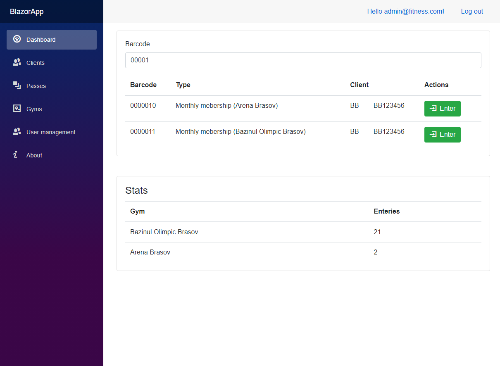

# Sapientia-2021-dotNet-Project (Fitness)

## Setup

```PowerShell
dotnet new gitignore
dotnet new sln
```

### MSSQL Server

The Microsoft SQL server is runing inside a docker container. You can set up using the following comand inside your Terminal.
You may want to change the password: **-e 'SA_PASSWORD=...'**.

```PowerShell
docker run --name mssql_server -e 'ACCEPT_EULA=Y' -e 'SA_PASSWORD=F8Cc2bswB6H5Bk!u' -p 1433:1433 -d mcr.microsoft.com/mssql/server:2019-latest
```

#### Example for creating database inside the container

Inside the Docker conteiner run the sqlcmd tool

```sh
/opt/mssql-tools/bin/sqlcmd -S localhost -U sa -P <your_password>
```

If the tool started corectly then you are greeted with **1>** prompter, then type:

```SQLCmd
CREATE DATABASE Fitness
GO
```

Now you have created the database. Create the schemas.

```SQL
DROP TABLE IF EXISTS [Fitness].[dbo].[Entries];
DROP TABLE IF EXISTS [Fitness].[dbo].[ClientPasses];
DROP TABLE IF EXISTS [Fitness].[dbo].[Gyms];
DROP TABLE IF EXISTS [Fitness].[dbo].[Clients];

CREATE TABLE [Fitness].[dbo].[Gyms] (
    [Id] INT IDENTITY(1,1) NOT NULL PRIMARY KEY,
    [Name] VARCHAR(64) NOT NULL,
    [IsDeleted] BIT NOT NULL DEFAULT(0)
);

DROP TABLE IF EXISTS [Fitness].[dbo].[Passes];
CREATE TABLE [Fitness].[dbo].[Passes]
(
    [Id] INT IDENTITY(1,1) NOT NULL PRIMARY KEY,
    [Name] VARCHAR(64) NOT NULL DEFAULT(''),
    [Price] DECIMAL(6,2) NOT NULL DEFAULT(0),
    [ValidForDays] INT not NULL DEFAULT(0),
    [ValidForEnteries] INT NOT NULL DEFAULT(0),
    [ValidForGymId] INT NOT NULL DEFAULT(0),
    [ValidFrom] INT not null DEFAULT(0),
    [ValidUntil] INT not null DEFAULT(24),
    [ValidPerDay] INT not null DEFAULT(1),
    [IsDeleted] BIT NOT NULL DEFAULT(0)
);

CREATE TABLE [Fitness].[dbo].[Clients]
(
    [Id] INT IDENTITY(1,1) NOT NULL PRIMARY KEY,
    [Name] VARCHAR(64) NOT NULL,
    [Phone] VARCHAR(16) NOT NULL,
    [Email] VARCHAR(128) NOT NULL,
    [IdCardNr] VARCHAR(16) NOT NULL,
    -- [photo] ,

    [IsDeleted] BIT NOT NULL DEFAULT(0),
    [Barcode] VARCHAR(64) UNIQUE NOT NULL,
    [InsertedAt] DATETIME NOT NULL default(getdate()),
    [Notes] VARCHAR(256) DEFAULT NULL
);

CREATE TABLE [Fitness].[dbo].[Entries]
(
    [Id] INT IDENTITY(1,1) NOT NULL PRIMARY KEY,
    [ClientId] INT NOT NULL
        FOREIGN KEY REFERENCES [Fitness].[dbo].[Clients](Id),
    [PassId] INT NOT NULL
        FOREIGN KEY REFERENCES [Fitness].[dbo].[Passes](Id),
    [GymId] INT NOT NULL
        FOREIGN KEY REFERENCES [Fitness].[dbo].[Gyms](Id),
    [EntryDate] DATETIME NOT NULL DEFAULT(getdate())
);

CREATE TABLE [Fitness].[dbo].[ClientPasses] (
    [Id] INT IDENTITY(1,1) NOT NULL PRIMARY KEY,
    [ClientId] INT NOT NULL
        FOREIGN KEY REFERENCES [Fitness].[dbo].[Clients](Id),
    [PassId] INT NOT NULL
        FOREIGN KEY REFERENCES [Fitness].[dbo].[Passes](Id),
    [DateOfPurchase] DATETIME NOT NULL DEFAULT(getdate()),
    [Barcode] VARCHAR(7) UNIQUE NOT NULL,
    [SellingPrice] DECIMAL(6,2) NOT NULL,
    [NumberOfEnteries] INT NOT NULL DEFAULT(0),
    [FirstUsedAt] INT DEFAULT(NULL),
    [IsValid] BIT NOT NULL DEFAULT(1),
);
```

### Blazor Web Server Application

```PowerShell
dotnet new blazorserver -n BlazorApp
dotnet sln add .\BlazorApp\BlazorApp.csproj
cd .\BlazorApp
dotnet add package Microsoft.AspNetCore.Identity.UI
dotnet add package Microsoft.AspNetCore.Identity.EntityFrameworkCore
dotnet add package Microsoft.EntityFrameworkCore.Design
dotnet add package Microsoft.EntityFrameworkCore.SqlServer

# This package at the time of creating the application was available in prerelase form.
dotnet add package Microsoft.AspNetCore.Components.Web.Extensions --prerelease
```

### DataLib

```PowerShell
dotnet new classlib -n DataAccessLayer
dotnet sln add .\DataAccessLayer\DataAccessLayer.csproj
dotnet add .\BlazorApp\BlazorApp.csproj reference DataAccessLayer/DataAccessLayer.csproj


cd .\DataAccessLayer
dotnet add package Microsoft.EntityFrameworkCore
dotnet add package Microsoft.EntityFrameworkCore.Design
dotnet add package Microsoft.EntityFrameworkCore.SqlServer
dotnet add package System.Configuration.ConfigurationManager
dotnet tool install --global dotnet-ef

# If you want to generate the model from the database.
# dotnet ef dbcontext scaffold "server='host.docker.internal';database=Fitness;user=sa;pwd='F8Cc2bswB6H5Bk!u;'" "Microsoft.EntityFrameworkCore.SqlServer" -o .\Models
# Migrating the database
dotnet-ef migrations add "Init"
# Your connection string may be different.
dotnet ef database update --connection "server='host.docker.internal';database=Fitness;user=SA;pwd='F8Cc2bswB6H5Bk!u';"
```

NuGet Packages:
[Microsoft.EntityFrameworkCore.Design](https://www.nuget.org/packages/Microsoft.EntityFrameworkCore.Design/),
[Microsoft.EntityFrameworkCore.SqlServer](https://www.nuget.org/packages/Microsoft.EntityFrameworkCore.SqlServer/6.0.0-preview.3.21201.2).
[System.Configuration.ConfigurationManager](https://www.nuget.org/packages/System.Configuration.ConfigurationManager/6.0.0-preview.3.21201.4)

CLI Tools:
[Microsoft.EntityFrameworkCore.Tools](https://www.nuget.org/packages/Microsoft.EntityFrameworkCore.Tools/6.0.0-preview.3.21201.2).

## Results


.png)
.png)
.png)

## Resources

1. [Build a web app with Blazor WebAssembly and Visual Studio Code](https://docs.microsoft.com/en-us/learn/modules/build-blazor-webassembly-visual-studio-code/)

2. [Create a .NET class library using Visual Studio Code](https://docs.microsoft.com/en-us/dotnet/core/tutorials/library-with-visual-studio-code)

3. [How to Access MySQL Database with Entity Framework Core](https://youtu.be/N10QW_AIOnI)

4. [Blazor WebAssembly - Form Validation Example](https://jasonwatmore.com/post/2020/07/31/blazor-webassembly-form-validation-example) [[Github]](https://github.com/cornflourblue/blazor-webassembly-form-validation)

5. [How to: Pad a Number with Leading Zeros](https://docs.microsoft.com/en-us/dotnet/standard/base-types/how-to-pad-a-number-with-leading-zeros)

6. [A Demonstration of Simple Server-side Blazor Cookie Authentication](https://blazorhelpwebsite.com/ViewBlogPost/36)

7. [**Microsoft bulshit**: email should be checked with email column](https://stackoverflow.com/questions/50089448/cant-login-with-created-user-in-net-core-2-0)

8. [A Simple Blazor User and Role Manager](https://blazorhelpwebsite.com/ViewBlogPost/21)

9. [Icons](https://useiconic.com/open)
